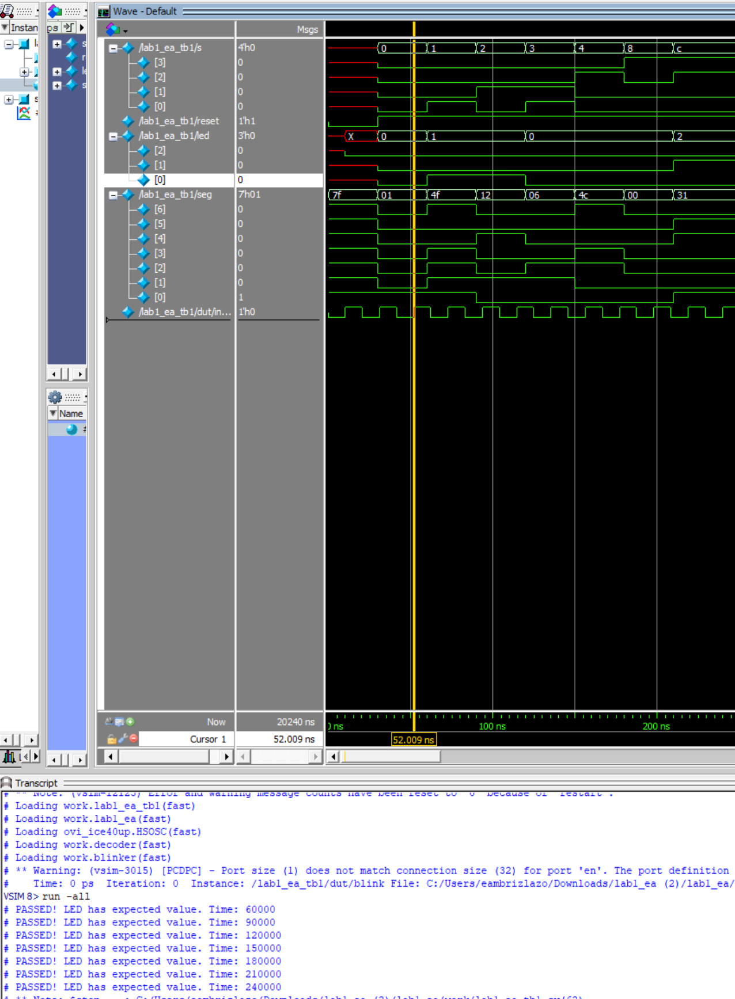
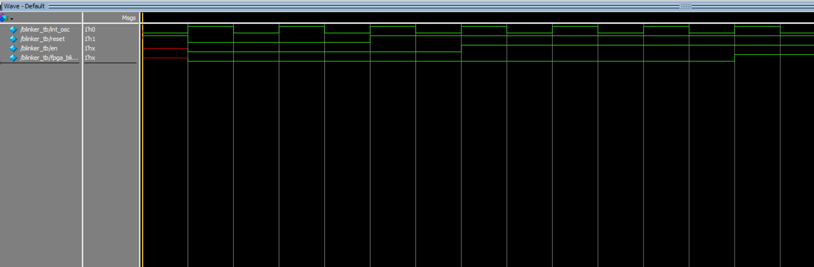
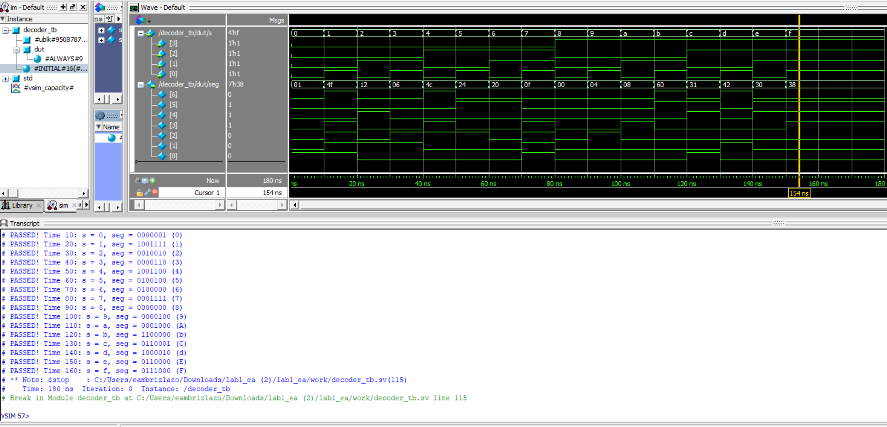
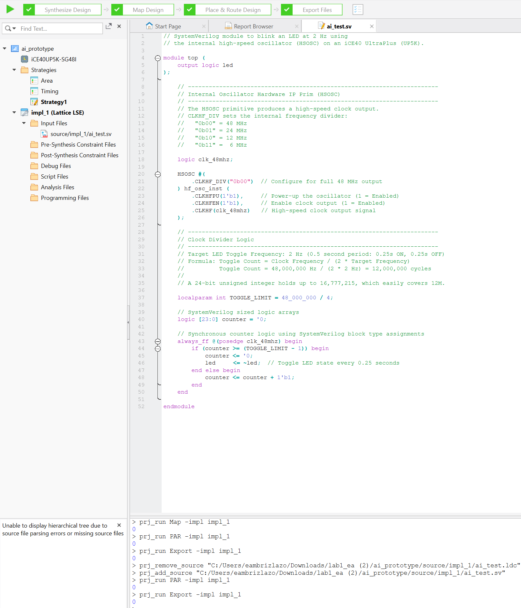

## Introduction

In this lab, we leveraged the FPGA aboard the MicroP's Dev Board (which was soldered and constructed per instructions on the E155 site). The FPGA was designed logically to illuminate two LEDs (also present on the Dev Board) following AND or XOR logic from a 4-input DIP switch. Second, a third LED on the Dev Board was instructed to blink at 2.4 Hz. This was done using a clock divider and the 48 MHz high speed oscillator on the board. Finally, the 4-input DIP switch was also logically connected to a 7-segment display such that the binary input would display the corresponding hexadecimal digit on the display. This lab took a total of 16 hours.

## Design and Testing Methodology

The first logic to approach was the 2 LEDs following simple gate logic. To do this, I used assign statements corresponding to the pins and the gate logic. For the testing methodology, a testbench was made and simulated that would confirm all possible outputs of the logic were properly observed and the LEDs illuminated as expected.
This same testbench was also used to confirm module connections occured and the on-board high-speed oscillator (`HSOSC`) from the iCE40 UltraPlus primitive library was generating a clock signal at 48 MHz.

::: {.callout-note title="Simple LED Gate Logic" collapse="true"}
	assign led[0] = s[1] ^ s[0]; //XOR logic for one LED
	assign led[1] = s[3] & s[2]; //AND logic for another LED
:::

On the note of the high-speed oscillator, the int_osc generated by the top-level module was the used in a blinker submodule as a clock input. With this input, a clock divider was created to convert 48 MHz to 2.4 Hz. This was done with a counter that reset when the counter reached 10,000,000. By parameterizing the MAX count, we can then use an easier testing module. The module also includes "reset" and "en" input logic so after testing that with proper LED output, we generate a different clock and parameterize so MAX count is 3 in the testbench. This allows us to see that when MAX count is reached, the counter does reset to 0 and the LED does toggle.

::: {.callout-note title="Blinking Logic" collapse="true"}
	logic [WIDTH-1:0] counter = 1'b0; //initial state of counter

	// Simple clock divider
	always_ff @(posedge int_osc)
		begin
			if (counter >= MAX) //The reason we want it to count up to this is because a 24 MHz clock divided by the trigger (10000000) as seen here to achieve 2.4 Hz
				begin
				counter <= 0;
				fpga_blink_out <= ~fpga_blink_out;
				end
			else if (!reset)
				begin
					counter <= 0;
					fpga_blink_out <= 0;
				end
			else begin
				if (en) counter <= counter + 1;
			end
		end
:::

Finally, the design logic for the seven segment display was implemented using an always_comb block with cases covering every 4-bit binary input and lighting up the relevant segments to create the hexadecimal digit. The seven bit output simply followings A-G segments as defined in the E155 logic to toggle segments. To test this, I covered all 16 cases and asserted the logical outputs and it passed with flying colors! (get it?)

::: {.callout-note title="Seven Segment Combinational Logic" collapse="true"}
	always_comb
		begin
			case(s)
				4'b0000: seg = 7'b0000001; //0
				4'b0001: seg = 7'b1001111; //1
				4'b0010: seg = 7'b0010010; //2
				4'b0011: seg = 7'b0000110; //3
				4'b0100: seg = 7'b1001100; //4
				4'b0101: seg = 7'b0100100; //5
				4'b0110: seg = 7'b0100000; //6
				4'b0111: seg = 7'b0001111; //7
				4'b1000: seg = 7'b0000000; //8
				4'b1001: seg = 7'b0000100; //9
				4'b1010: seg = 7'b0001000; //A
				4'b1011: seg = 7'b1100000; //B
				4'b1100: seg = 7'b0110001; //C
				4'b1101: seg = 7'b1000010; //D
				4'b1110: seg = 7'b0110000; //E
				4'b1111: seg = 7'b0111000; //F
				default: seg = 7'b1111111; //default case
			endcase
		end
:::

## Technical Documentation:

The source code for the project can be found in the associated [Github repository](https://github.com/EduardoAmbrizLazo/e155-lab1/tree/main/fpga).

### Block Diagram

::: {#fig-block-diagram}

Block diagram of the Verilog design.
:::

The block diagram in @fig-block-diagram demonstrates the overall architecture of the design.
The top-level module `lab1_ea` includes two submodules: the blinker/counter for the 2.4 Hz LED (`blinker`) and the 7-segment display logic module (`decoder`).

### Schematic
::: {#fig-schematic}

Schematic of the physical circuit.
:::

@fig-schematic shows the physical layout of the design.
The FPGA communicates with on-board LEDs and the seven-segment display via a network of 150 k$\Omega$ resistors. This value was found by subtracting the 2V voltage drop from 3.3 V input voltage and dividing by the expected 10 mA. This results in about 120 ohms. A reset push button is also present.

## Results and Discussion

The overall design and construction was successful as confirmed via simulation (incoming) and through the physical circuitry. I was able to oscilloscope 2.4 Hz and observe the proper LED gate logic on the Dev Board. Furthermore, the seven-segment display does display the proper hexadecimal digit.

### Testbench Simulation

::: {#fig-testbench1 collapse = "true"}

A screenshot of a QuestaSim simulation demonstrating the top-level module properly calling on submodules, the HSOSC int_osc toggling, and the proper LED gate logic.
:::

The design met all intended design objectives.
@fig-testbench1 shows a screenshot of the QuestaSim simulation.

::: {#fig-testbench2 collapse = "true"}

A screenshot of a QuestaSim simulation demonstrating the blinker submodule testing whether reset and enable works and verifying we get fpga_blink_out to properly trigger after the expected number of ns for the parameterized counter.
:::

The design met all intended design objectives.
@fig-testbench2 shows a screenshot of the QuestaSim simulation.

::: {#fig-testbench3 collapse = "true"}

A screenshot of a QuestaSim simulation demonstrating the decoder submodule 
:::

The design met all intended design objectives.
@fig-testbench3 shows a screenshot of the QuestaSim simulation.

## Conclusion

The design successfully programmed the 7-segment display and outputted the right LED logic. I learned a lot about testbenches, communication between modules, etc.

## AI Prototype Summary

::: {#fig-aisynthesis}

A screenshot of a the synthesis of the logic the AI created. 
:::

It did successfully synthesize on the first go but I noticed some unusual and the variables were strangely defined. The logic and comments are extremely helpful and I can see how this can be used as a very valuable tool but I'm also not quite sure if this would be helpful since a person using this for multiple modules might be confused when communicating with other modules. 

Overall, however, it was extremely clean and with some polish and understanding of the AI's logic and how to expand on it, it can be a useful basis. I think, in the end, the prompt is pretty simple to tackle and the AI is efficient at it.

@fig-aisynthesis shows a screenshot of the synthesis.

## Resources

The source code for the project can be found in the associated [Github repository](https://github.com/EduardoAmbrizLazo/e155-lab1/tree/main/fpga).