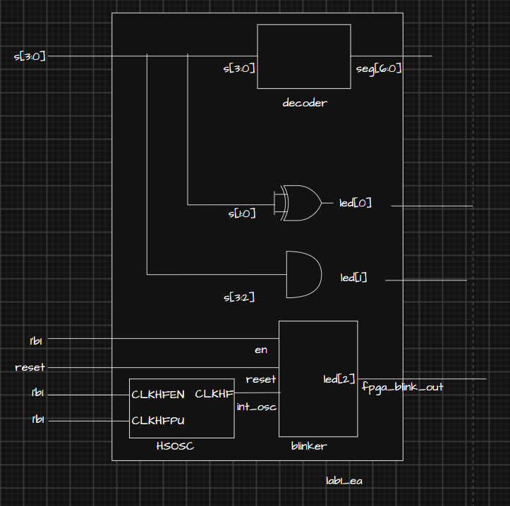
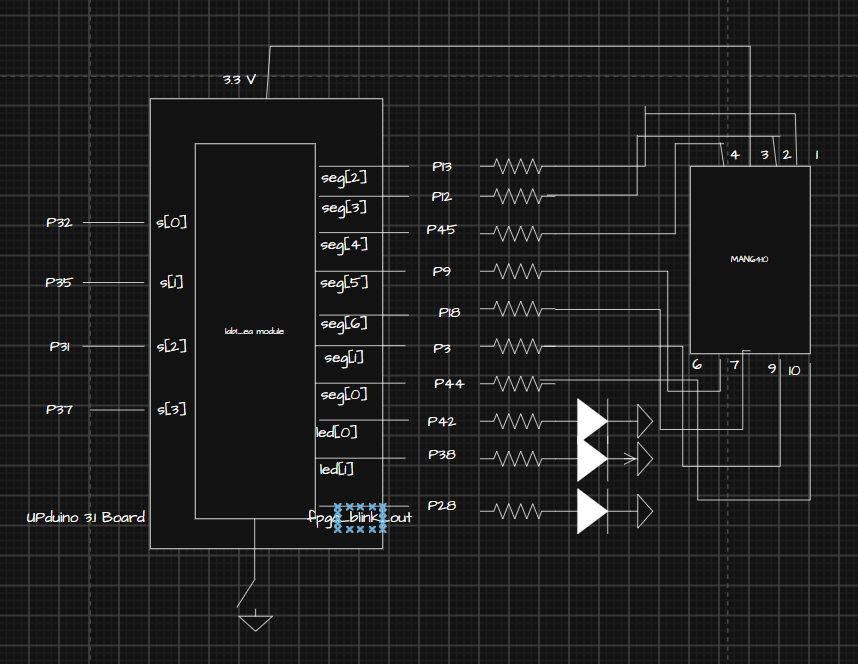

::: {.callout-tip title="Annotated Report Template"}
The following is a template to clarify what should be part of the writeup you post for each lab you complete.
It is a sample report written to explain a simple FPGA blink demo.
Each section contains a brief explanation of the purpose of the section and the information that should be included in it.
:::

## Introduction

In this lab, we leveraged the FPGA aboard the MicroP's Dev Board (which was soldered and constructed per instructions on the E155 site). The FPGA was designed logically to illuminate two LEDs (also present on the Dev Board) following AND or XOR logic from a 4-input DIP switch. Second, a third LED on the Dev Board was instructed to blink at 2.4 Hz. This was done using a clock divider and the 48 MHz high speed oscillator on the board. Finally, the 4-input DIP switch was also logically connected to a 7-segment display such that the binary input would display the corresponding hexadecimal digit on the display.

## Design and Testing Methodology

The first logic to approach was the 2 LEDs following simple gate logic. To do this, I used assign statements corresponding to the pins and the gate logic. For the testing methodology, a testbench was made and simulated that would confirm all possible outputs of the logic were properly observed and the LEDs illuminated as expected.
This same testbench was also used to confirm module connections occured and the on-board high-speed oscillator (`HSOSC`) from the iCE40 UltraPlus primitive library was generating a clock signal at 48 MHz.

::: {.callout-note title="Technical Documentation" }
Include a link to a Git repository with your Verilog code, a block diagram of your design, and schematics of your circuits.
:::

On the note of the high-speed oscillator, the int_osc generated by the top-level module was the used in a blinker submodule as a clock input. With this input, a clock divider was created to convert 48 MHz to 2.4 Hz. This was done with a counter that reset when the counter reached 10,000,000. By parameterizing the MAX count, we can then use an easier testing module. The module also includes "reset" and "en" input logic so after testing that with proper LED output, we generate a different clock and parameterize so MAX count is 3 in the testbench. This allows us to see that when MAX count is reached, the counter does reset to 0 and the LED does toggle.

Finally, the design logic for the seven segment display was implemented using an always_comb block with cases covering every 4-bit binary input and lighting up the relevant segments to create the hexadecimal digit. The seven bit output simply followings A-G segments as defined in the E155 logic to toggle segments. To test this, I covered all 16 cases and asserted the logical outputs and it passed with flying colors! (get it?)

::: {.callout-note title="Seven Segment Combinational Logic" }
'

'
:::

## Technical Documentation:

The source code for the project can be found in the associated [Github repository](https://github.com/HMC-E155/fpga-blink-test-demo).

### Block Diagram

::: {#fig-block-diagram}

Block diagram of the Verilog design.
:::

The block diagram in @fig-block-diagram demonstrates the overall architecture of the design.
The top-level module `top` includes two submodules: the high-speed oscillator block (`HSOSC`) and the clock divider module (`clk_divider`).  Every net and port in the block diagram must be labeled -- that means each wire at the top level has to have a name, and the connection to a submodule must show the name inside the module.  This is true even if the submodule port name is the same as the top level net name.

### Schematic
::: {#fig-schematic}

Schematic of the physical circuit.
:::

@fig-schematic shows the physical layout of the design.
An internal 100 k$\Omega$ pullup resistor was used to ensure the active low reset pin was not floating.
The output LED was connected using a 1 k$\Omega$ current-limiting resistor to ensure the output current (~2.6 mA) did not exceed the maximum output current of the FPGA I/O pins.

## Results and Discussion

The overall design and construction was successful as confirmed via simulation (incoming) and through the physical circuitry. I was able to oscilloscope 2.4 Hz and observe the proper LED gate logic on the Dev Board. Furthermore, the seven-segment display does display the proper hexadecimal digit.

### Testbench Simulation

::: {#fig-testbench}

A screenshot of a QuestaSim simulation demonstrating the blinking output signal. Note that the timescale for the clock divider was modified to divide by 4.
:::

The design met all intended design objectives.
@fig-testbench shows a screenshot of the QuestaSim simulation.
If a more precise output frequency was desired, a more sophisticated counter could be developed.
The current design only allows for the clock to be divided by powers of two.

## Conclusion

::: {.callout-note title="Conclusion" }
Briefly summarize what was done and how it performed. Also note how many hours you spent working on the lab.
:::

The design successfully blinked an external LED using the on-board high-speed oscillator.
I spent a total of two hours working on this lab.

## AI Prototype Summary

Include generated code, easy-to-read chat transcripts, and a reflection on how well it worked.